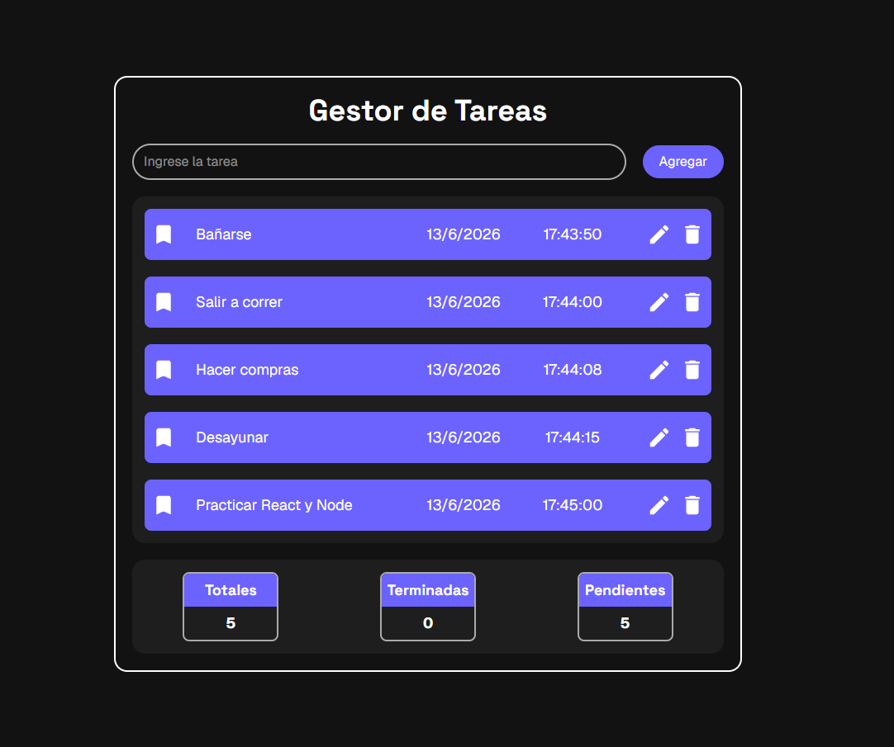
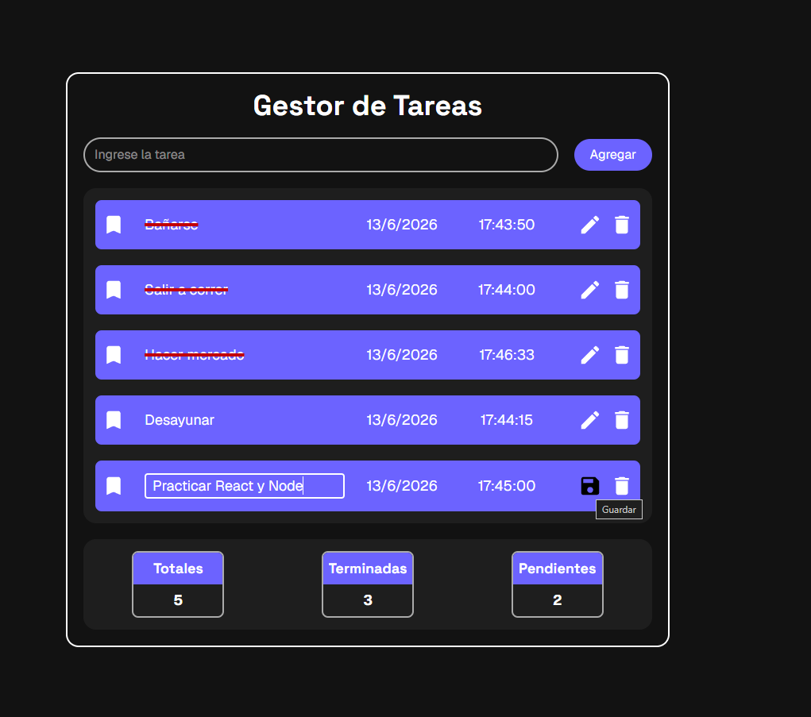
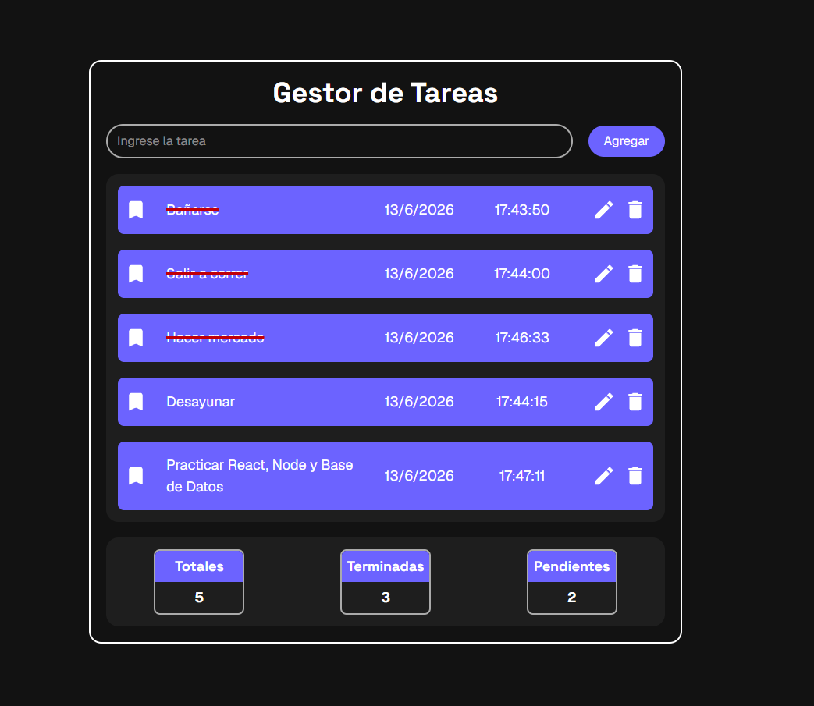

# 📝 To-Do List App



Aplicación de gestión de tareas desarrollada con React, TypeScript y Firebase Firestore.

Permite crear, editar, completar y eliminar tareas, manteniendo la información persistente en la nube mediante Firestore.

---

## 🚀 Demo

[Próximamente disponible en Vercel.](https://to-do-list-firebase-murex.vercel.app/)

---

## ✨ Características

- ✅ Crear tareas
- ✏️ Editar tareas
- 🗑️ Eliminar tareas
- ✔️ Marcar tareas como completadas
- ☁️ Persistencia de datos con Firebase Firestore
- 📊 Resumen automático de tareas:
  - Totales
  - Terminadas
  - Pendientes
- 🎨 Interfaz moderna y responsive

---

## 🛠️ Tecnologías utilizadas

- React
- TypeScript
- Firebase Firestore
- Tailwind CSS
- Vite
- React Icons

---

## 📂 Arquitectura del proyecto

```text
src/
├── components/
├── hooks/
├── firebase/
├── types/
└── assets/
```

### Hooks personalizados

#### useTareas

Responsable de:

- Obtener tareas desde Firestore
- Crear tareas
- Actualizar tareas
- Eliminar tareas
- Gestionar el estado local

#### useResumen

Calcula automáticamente:

- Número total de tareas
- Tareas completadas
- Tareas pendientes

---

## 🔥 Integración con Firebase

La aplicación utiliza Firestore como base de datos NoSQL para almacenar y sincronizar tareas.

Operaciones implementadas:

- addDoc()
- getDocs()
- updateDoc()
- deleteDoc()

---

## 📸 Capturas de la aplicación

### App


### Editando





---

## ⚙️ Instalación

Clonar el repositorio:

```bash
git clone https://github.com/tu-usuario/tu-repositorio.git
```

Entrar al proyecto:

```bash
cd tu-repositorio
```

Instalar dependencias:

```bash
pnpm install
```

Ejecutar en desarrollo:

```bash
pnpm dev
```

Generar build:

```bash
pnpm build
```

---

## 🔐 Variables de entorno

Crear un archivo `.env`:

```env
VITE_FIREBASE_API_KEY=
VITE_FIREBASE_AUTH_DOMAIN=
VITE_FIREBASE_PROJECT_ID=
VITE_FIREBASE_STORAGE_BUCKET=
VITE_FIREBASE_MESSAGING_SENDER_ID=
VITE_FIREBASE_APP_ID=
```

---

## 🎯 Próximas mejoras

- Manejo avanzado de errores
- Actualización en tiempo real mediante onSnapshot()
- Firebase Authentication
- Reglas de seguridad por usuario
- Filtros de búsqueda
- Ordenamiento de tareas
- Paginación y optimización de consultas

---

## 👨‍💻 Autor

Desarrollado por Elias.

Proyecto creado como práctica de desarrollo Frontend moderno utilizando React, TypeScript y Firebase.
